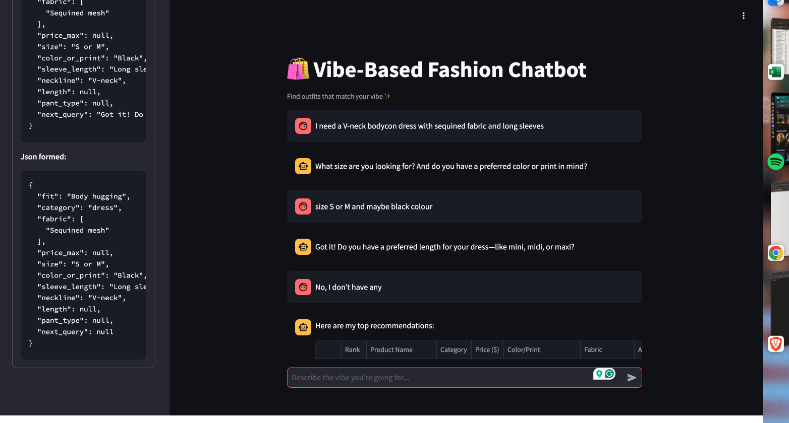
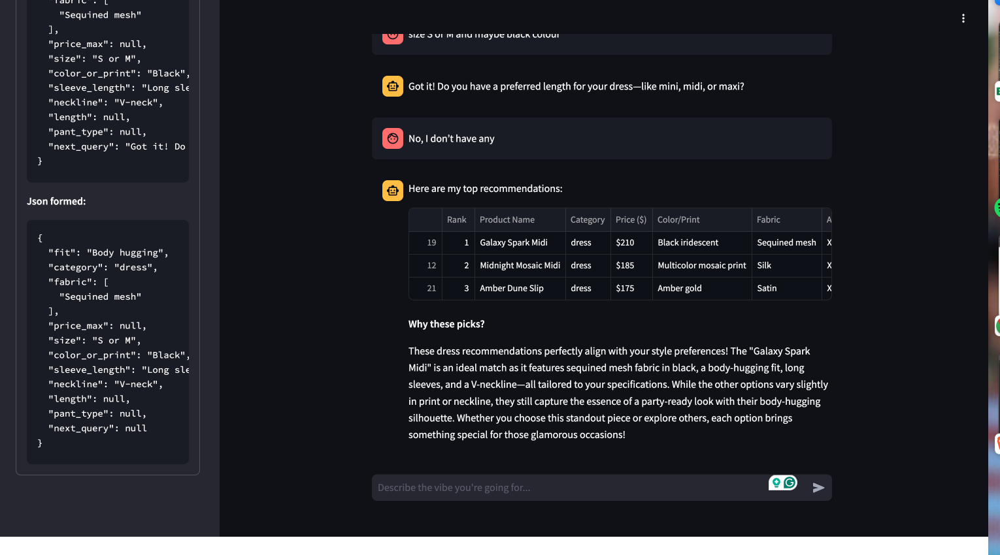

# Vibe Mapping Agent: AI-Powered Fashion Recommendation System

## Overview

The Vibe Mapping Agent is an interactive, AI-driven fashion recommendation system built with Streamlit. It helps users find clothing items that match their unique style "vibe" by translating natural language queries into structured fashion attributes, then recommending the most relevant products from a catalog using a hybrid of semantic search(embedding) and rule-based filtering.

**Key Features:**
- Conversational interface for users to describe their desired fashion vibe.
- LLM-powered mapping from free-text queries to structured fashion attributes (fit, category, fabric, color, etc.).
- Friendly, non-repetitive follow-up questions to clarify missing preferences.
- Hybrid recommendation engine combining semantic similarity (embeddings) and strict, soft rule-based filtering.
- LLM-generated summaries explaining why recommendations fit the user's vibe.
- Support for Ollama(local) model for LLM inference
- You can view the json in the side bar in the debug console for checking the attributes extracted from the user query.
---

## How It Works

1. **User Query:**
   - The user describes their desired outfit or vibe in natural language (e.g., "something cute for brunch").

2. **Vibe Mapping (LLM):**
   - The system uses a language model to extract structured attributes (category, fit, fabric, color, etc.) from the query.
   - If information is missing, the agent asks friendly, non-repetitive follow-up questions (max 2) to clarify.

3. **Recommendation Engine:**
   - The user's structured preferences are converted into a value-only, ordered string and embedded using a SentenceTransformer model.
   - The product catalog is pre-embedded in the same way.
   - The system retrieves the top-k semantically similar products using FAISS.
   - Strict filters (category, size, price, pant type) are applied; other fields (fit, fabric, color, etc.) are soft-scored for best match.

4. **Results & Explanation:**
   - The top recommendations are shown in a table.
   - An LLM-generated summary explains why these picks fit the user's vibe.

---

## Project Structure

```
├── app.py                # Streamlit app: UI, chat logic, LLM calls
├── recommandation.py     # ProductRecommender: embedding, filtering, scoring(hybrid)
├── system_prompt.py      # System prompt for LLM vibe-to-attribute mapping
├── Apparels_shared.xlsx  # Product catalog (Excel)
├── requirements.txt      # Python dependencies
├── embeddings_cache/     # Cached embeddings, FAISS index, metadata
```

---

## Setup & Installation

1. **Clone the repository:**
   ```sh
   git clone <repo-url>
   cd fashion-agent
   ```

2. **Install dependencies:**
   ```sh
   pip install -r requirements.txt
   ```

3. **Add your product catalog:**
   - Place your `Apparels_shared.xlsx` file in the project root (or use the provided sample).

4. **(Optional) Configure LLM backend:**
   - The app uses [Ollama](https://ollama.com/) for local LLM inference. You can change the model in the sidebar.

5. **Run the app:**
   ```sh
   streamlit run app.py
   ```
---

## Usage

- Enter a description of your desired vibe or outfit in the chat (e.g., "something flowy for a summer wedding").
- The agent will ask up to two friendly follow-up questions if needed.
- Once enough information is gathered, you'll see the top 3 product recommendations and a summary of why they fit your vibe.
- The inference might take some time(< 1 minute) as I'm using a local Ollama model for LLM inference as I don't have access to OpenAI API.
- You can view the extracted attributes in the sidebar for debugging purposes.

---

## Technical Details

- **Embeddings:** Uses `sentence-transformers/all-mpnet-base-v2` for semantic similarity.
- **Indexing:** Uses FAISS for fast nearest-neighbor search over product embeddings.
- **LLM:** Ollama (local) models for vibe-to-attribute mapping and summaries.
- **Caching:** Embeddings and FAISS index are cached in `embeddings_cache/` for fast startup.
- **Follow-up Questions:** Implemented with a simple system prompt with some few shot prompting examples to ensure accurate, friendly interaction without repetition.
- **Debugging:** View the extracted attributes in the sidebar for troubleshooting.
- **Streamlit:** Provides the web interface and handles user interactions.
- **Recommendation Logic:** Combines strict filtering first (category, size, price, pant type) with soft scoring for other attributes (fit, fabric, color, ... etc).

---

Sample examples images:



---

